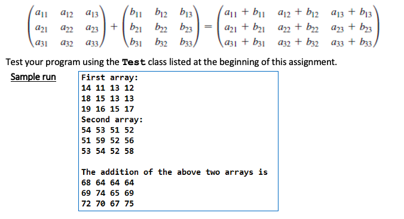
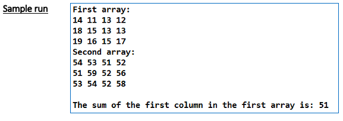
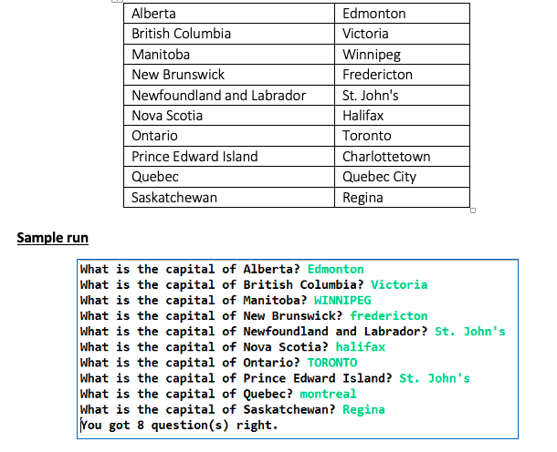

# Lab 11 - Multi-dimensional arrays

## Expectations

We are expecting you to commit your work often with useful commit messages.
This is helpful for you so that there are regular commits that demonstrate your progress. 
In case you forget to push your final commits before the deadline, at least you will get partial marks.

This means that you should commit and push your changes to the repository at least **FIVE** times as you work this lab (more is recommended).
Repositories that have very few commits will be flagged for careful scrutiny and review, and you will **definitely** lose marks for this! 

## Test Your Code

Use the following class to test the methods you develop in Q1 and Q2. 

```
public class Test {
  public static void main(String[] args) {
    int [][] m1 = { { 14, 11, 13, 12 },
                    { 18, 15, 13, 13 },
                    {19, 16, 15, 7 } };
                  
    int [][] m2 = { { 54, 53, 51, 52 },
                    { 51, 59, 52, 56 },
                    { 53, 54, 52, 58 } };
                    
    System.out.println("First array:");
    displayArray(m1);
    System.out.println("Second array:");
    displayArray(m2);
    
    /* write simple code to test your method and us displayarray() to display the result if applicable */
 }
 
 public static void displayArray(int [][] m) {
    for (int r=0; r<m.length; r++){
      for (int c=0; c< m[r].length; c++)
        System.out.print(m[r][c] + " ");
      System.out.println();
    }
 }
}
 ```

For all questions, assume that we use only rectangular arrays (i.e., all rows have the same length).

## Q1: [10 marks] Matrix Sum 

Write code that finds the sum of two matrices. Use the following method header 

```
public static int[][] addMatrix(int[][] a, int[][] b)
```

The rules for adding two matrices are:

- both matrices should have the exact same dimensions (i.e. height and width) – you need to check for this rule in your program.
- both matrices should have elements that have compatible types – you don’t have to add extra code to check this rule in your method as it will only accept int arrays.

As seen in the image below, the resulting matrix elements should be the sum of the respective pair of elements from the two matrices (that are being added):



## Q2: [10 marks] Sum of elements in a 2D array

Write a method that returns the sum of all the elements in a specified column in a 2-D array using the following header: 

```
public static int sumCol(int[][] m, int colIdx)
```

Test your program using the Test class listed at the beginning of this document. 



## Q3: [10 marks] Province Capitals

Code an exam in Java that repeatedly asks the user to enter the capital for a province in Canada. Then, the program should report whether the answer is correct. Eventually, you must display how many answers the user guessed correctly.

The requirements are as follows: 

- Use a 2D array to hold the provinces and their capitals (as implied by the table below)
- Answers are not case-sensitive (e.g. Toronto and tOrOnto are considered the same)
- You do not need to integrate the Test class (from page #1 above) in your code for this question.



## Grading area

### Link to files

You do not have to do anything in this section.

[Q1 Java file](./Q1.java)

[Q2 Java file](./Q2.java)

[Q3 Java file](./Q3.java)

Remember to commit all your changes and to submit the link to this repository on Canvas.
